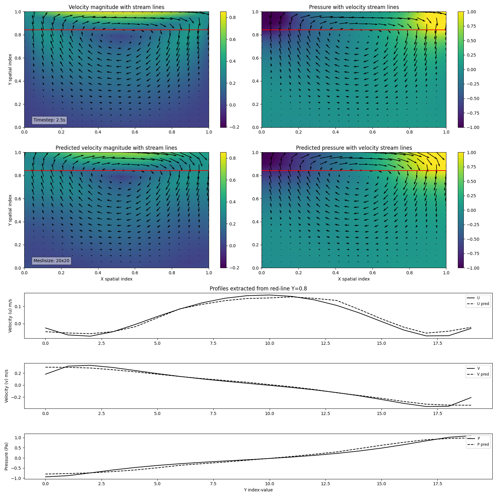

# CFDPINN

**C**omputational **F**luid **D**ynamics **P**hysics **I**nformed **N**eural **N**etwork

**Author**: Harry McHugh \
**Supervisor**: Adrian Jackson

**Dissertation Title**: \
```On the suitability of physics informed neural networks to accelerate computational fluid dynamics ```


## Project motivation
Many computational simulations are too intensive to be useful, even with the use of modern supercomputing facilities. 

This is particularly true of fluid dynamics codes, and even more so, when the Reynolds number is very high.

Machine learning has scope to improve the performance of these simulations, by shifting much of the computation "offline" into the model training phase, leaving almost real-time simulation via inference.

## Project aims
Physics informed neural networks have been seen to perform better than traditional deep learning models when learning physical laws.

Therefore, this project aims to acheive the following goals:

- Produce a PINN that is capable of accurately predicting 2D fluid-flow properties
- Compare the performance and process of training PINNs with traditional methods.
- Test multiple scenarios to ascertain under what conditions PINNs succeed or fail. 

By achieving these aims we feel we will be able to provide a meaningful commentary on the question; “To what extent PINNs are able to accelerate CFD?”

## Installing CFDPINN
### Containers
The recommended method for reproducing the work described in the accompanying dissertation is to obtain the Docker image with all binaries pre-built and installed inside the container.

For detailed instructions on how to obtain the docker container please consult the following [README](./containers/README.md).

### Manual installation
Should you wish to install the source code for CFDPINN yourself you can clone this repository and simply install the CFDPINN application by running the following command in the root of the directory.

```
git clone --depth 1 git@github.com:harrymchugh/pinns.git
cd pinns
pip install -e .
```

## Running CFDPINN
There are three main stages to reproducing the work in this dissertation.

The first is to generate simulation data which acts as a reference to current industry methods for generating fluid properties with the computational fluid dynamics application OpenFOAM.

Once the OpenFOAM simulation is complete we can use the CFDPINN application in this repository to train a physics-informed neural network (PINN).

Additionally pre-trained models can be used to predict fluid properties in *"inference-only"* mode varying certain parameters such as output mesh and geometry.

Example scripts are provided for OpenFOAM [simulations](./openfoam/scripts/cavity-nu0.01-U1-20x20.sh), [PINN training](./training/training.sh) and [inference](./inference/inference.sh).

### Running CFDPINN manually
These scripts assume they will be run inside the supplied container. Detailed instructions on how to run each stage using the supplied containers are provided [here](./containers/README.md).

Should you wish to run these locally please ensure your environment is setup so that the applications and libraries are accessible and the paths used in the provided scripts updated to point to your specific filesystem locations.

## CFDPINN application arguments
The CFDPINN application has been written to ingest many parameters at the command line to provide flexibility in its use cases.

For full observation of the available parameters in CFDPINN run the following command.

```
cfdpinn -h
```
## Tensorboard; debugging, profiling and performance
In addition to simply running OpenFOAM simulation, training and inference CFDPINN allows users to use Tensorboard to interrogate profiling data (to assess PyTorch performance) and to view machine learning metrics such as testing and training losses in real-time or once training is complete.

Once again the recommended method for viewing Tensorboard and the accompanying data is to use the supplied Docker container which has Tensorboard built in. 

For instructions on how to start Tensorboard and expose it's server for viewing in a local web browser please see the "Tensorboard" section of the container [README](./containers/README.md).

Should you have Tensorboard installed locally you can simply start a Tensorboard session as follows.

```
tensorboard --logdir=/path/to/tboarddata
```

This will start a server and a link will be printed that can be navigated to in order to view the data.